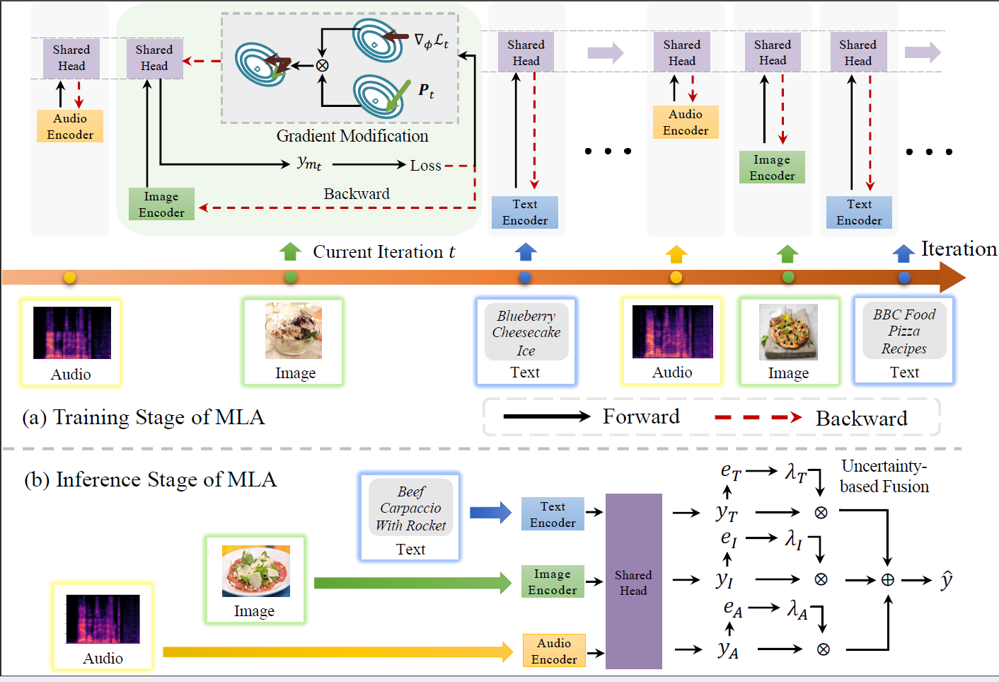

# Multimodal Learning with Alternating Unimodal Adaptation

This is the official project of the Multimodal Learning with Alternating Unimodal Adaptation (MLA) method proposed by our paper titled 'Multimodal representation learning by alternating unimodal adaptation' [paper](https://arxiv.org/pdf/2311.10707.pdf) published on the 40th The IEEE / CVF Computer Vision and Pattern Recognition Conference (CVPR 2024).

## Citation

If you find this toolkit useful, please consider citing following papers.
```
@InProceedings{Zhang_multimodal,
    author    = {Zhang, Xiaohui and Yoon, Jaehong and Bansal, Mohit and Yao, Huaxiu},
    title     = {Multimodal Representation Learning by Alternating Unimodal Adaptation},
    booktitle = {Proceedings of the IEEE/CVF Conference on Computer Vision and Pattern Recognition (CVPR)},
    month     = {June},
    year      = {2024},
    pages     = {27456-27466}
}

```
### Introduction 
Existing multimodal learning methods often struggle with challenges where some modalities appear more
dominant than others during multimodal learning, resulting in suboptimal performance. To address this challenge, we propose MLA (Multimodal Learning with Alternating Unimodal Adaptation). MLA reframes the conventional joint multimodal learning process by transforming it into an alternating unimodal learning process, thereby minimizing interference between modalities. Simultaneously, it captures cross-modal interactions through a shared head, which undergoes continuous optimization across different modalities.
This optimization process is controlled by a gradient modification mechanism to prevent the shared head from losing previously acquired information. During the inference phase, MLA utilizes a test-time uncertainty-based model fusion mechanism to integrate multimodal information.



<!--  -->

### News
1. We have released some checkpoints trained by MLA. You could find them on [here](https://zenodo.org/records/10828670).

### Step 1. Environment Creation
You can use the following commands to create your environment:
1. ``conda create -n MLA --python 3.8``
2. ``pip install -r requirements.txt``
### Step 2. Data Preparation
1. Download your Dataset.
2. Data Pre-processing
   1. You can convert mp4 file to wav audio using ``python data/mp4_to_wav.py``.
      1. Then extract acoustic fbank feature using ``python data/extract_fbank.py`` 
      2. or spectrum feature using ``python data/extract_spec.py``.
   2. You can extract textual token using ``python data/extract_token.py``.
   3. You can process and extract visual feature using ``python data/video_preprocessing.py``.
3. Generate datalist
   1. Using ``python data/gen_stat.py`` to create label list
   2. Using ``python data/gen_{dataset_name}_txt.py`` to create data list
### Step 3. Training
#### For training on CREMA-D with audio-video modalities:  
##### Normal
```
  python main.py --train --ckpt_path ckpt --gpu_ids 0 --batch_size 64 --lorb base --modulation Normal --epochs 100 --dataset CREMAD
```
##### OGM (-GE)
```
  python main.py --train --ckpt_path ckpt --gpu_ids 0 --batch_size 64 --lorb base --modulation OGM (-GE) --epochs 100 --dataset CREMAD
```
##### QMF
```
  python main.py --train --ckpt_path ckpt --gpu_ids 0 --batch_size 64 --lorb base --modulation QMF --epochs 100 --dataset CREMAD
```
##### MLA (fixed fusion)
```
  python main.py --train --ckpt_path ckpt --gpu_ids 0 --batch_size 64 --lorb base --modulation Normal --epochs 100 --dataset CREMAD --gs_flag
```
##### MLA (dynamic fusion)
```
  python main.py --train --ckpt_path ckpt --gpu_ids 0 --batch_size 64 --lorb base --modulation Normal --epochs 100 --dataset CREMAD --gs_flag -dynamic
```
#### For training on Food-101 (MVSA) with video-text modalities:
Sames as the command of CREMA-D, with a few change.
For example:
##### MLA (dynamic fusion)
```
  python main.py --train --ckpt_path ckpt --gpu_ids 0 --batch_size 64 --lorb m3ae --modulation Normal --epochs 100 --dataset Food101 (MVSA) --gs_flag -dynamic
```
#### For training on IEMOCAP with audio-video-text modalities:
Sames as the command of CREMA-D, with a few change.
For example:
##### MLA (dynamic fusion)
```
  python main.py --train --ckpt_path ckpt --gpu_ids 0 --batch_size 64 --lorb m3ae --modulation Normal --epochs 100 --dataset IEMOCAP --gs_flag -dynamic --modal3
```
#### Training using CLIP feature
Comming soon...
### Setp 4. Evaluation
#### Evaluating on a specific dataset (e.g. CREMA-D):
```
  python main.py --ckpt_path ckpt_path --gpu_ids 0 --batch_size 64 --lorb base --modulation Normal --dataset CREMAD (--gs_flag)
```
